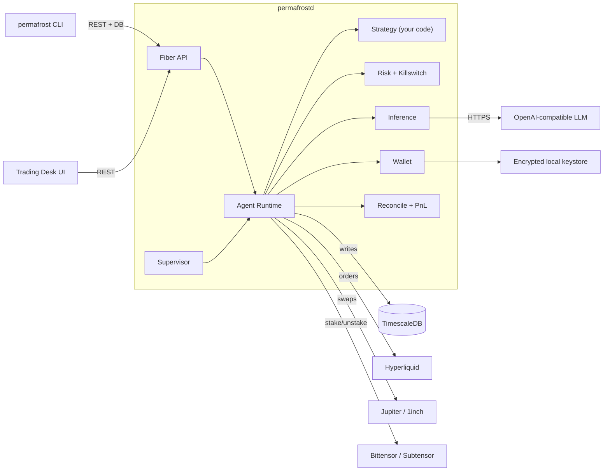

<div align="center">


# Permafrost

**Your AI trading desk, locked in the ice.**

<br/>


<sub>Three alpha-trading agents — Tao, Mo, Yumi — executing real on-chain swaps on a local Subtensor devnet.</sub>

<br/><br/>

[](https://opensource.org/licenses/MIT)
[](https://go.dev/)
[](https://github.com/teslashibe/permafrost/releases)
[](https://teslashibe.github.io/permafrost/)
[](https://hyperliquid.xyz/)
[](https://solana.com/)
[-FF6B35)](https://bittensor.com/)

<br/>

📚 **[Read the docs](https://teslashibe.github.io/permafrost/)** &middot; 🐧 **[Run the demo](https://teslashibe.github.io/permafrost/getting-started/make-demo)** &middot; 🦊 **[Bittensor alpha tokens](https://teslashibe.github.io/permafrost/getting-started/bittensor)** &middot; 🐳 **[The Cast](https://teslashibe.github.io/permafrost/brand/cast)**

</div>

<br/>

---

<br/>

<table>
<tr>
<td width="55%" valign="top">

### What this is

A self-custodied, locally-runnable **Go framework** for algorithmic trading with optional **LLM augmentation**. Write deterministic strategies, optionally augment them with an LLM veto, and the framework handles exchange adapters, swap routing, reconciliation, PnL accounting, risk gates, the killswitch, and decision provenance.

Strategies are first-class extensions, not patches. Each one lives as its own subdirectory under `strategies/`, calls `strategy.Register` in `init()`, and is enabled by adding one blank-import line.

</td>
<td width="45%" valign="top">

### Ships with 6 strategies

| Strategy | What it does |
|---|---|
| `noop` | Smoke-test — returns `Decision{}` every tick |
| `dca_buy` | DCA into any spot asset (Solana, EVM) |
| `market_maker_basic` | Paired bid/ask on Hyperliquid + LLM veto |
| **`alpha_dca`** | DCA into Bittensor subnet alpha tokens |
| **`alpha_momentum`** | Rotate into top-K subnets by momentum |
| **`alpha_yield`** | Stake into highest-stability subnets |

</td>
</tr>
</table>

<br/>

---

<br/>

## Quick start

> Requires **Docker** and **Go 1.25+**.

<table>
<tr>
<td width="50%">

#### Classic demo (paper mode)

```bash
git clone https://github.com/teslashibe/permafrost.git
cd permafrost
make demo
```

Builds binaries, brings up Postgres + `permafrostd` in Docker, recruits a paper-mode `noop` agent named **Pip**, and tails decisions. Tear down: `make demo-clean`.

</td>
<td width="50%">

#### Bittensor demo (live, on-chain)

```bash
git clone https://github.com/teslashibe/permafrost.git
cd permafrost
make demo-bittensor
```

Same stack **plus** a local Subtensor chain + noise trader. Three live agents execute real `add_stake_limit` extrinsics. Tear down: `make demo-bittensor-clean`.

</td>
</tr>
</table>

Then open the **Trading Desk UI**:

```bash
cd apps/desk && npm install && npm run dev    # → http://127.0.0.1:5173
```

<br/>

---

<br/>

## The expedition

Every moving part has a hand-authored pixel-art SVG sprite that animates on the [Trading Desk UI](https://teslashibe.github.io/permafrost/operations/trading-desk-ui).

<div align="center">
<table>
<tr>
<td align="center" width="11%"><br/><b>Pole</b><br/><sub>Camp Director</sub></td>
<td align="center" width="11%"><br/><b>Penguin</b><br/><sub>Strategy agent</sub></td>
<td align="center" width="11%"><br/><b>Narwhal</b><br/><sub>LLM consult</sub></td>
<td align="center" width="11%"><br/><b>Aurora</b><br/><sub>Risk monitor</sub></td>
<td align="center" width="11%"><br/><b>Skipper</b><br/><sub>Reconciler</sub></td>
<td align="center" width="11%"><br/><b>Kelp</b><br/><sub>Swap router</sub></td>
<td align="center" width="11%"><br/><b>Frostbite</b><br/><sub>Killswitch</sub></td>
<td align="center" width="11%"><br/><b>Tusk</b><br/><sub>Private strategy</sub></td>
</tr>
</table>
</div>

<br/>

---

<br/>

## What you get out of the box

| Area | Capabilities |
|---|---|
| **Framework** | Generic Strategy SAPI · Hummingbot-style `strategies/` tree · `pkg/strategy`, `pkg/types`, `pkg/inference` |
| **Perp venues** | Hyperliquid (EIP-712 action signing, OpenOrders, idempotent place/cancel) |
| **Spot venues** | Solana via Jupiter (Jito bundles) · EVM via 1inch v6 (Ethereum, Base, Avalanche, BSC) · **Bittensor subnet alpha tokens** (sr25519 signing, `add_stake_limit` / `remove_stake_limit`) |
| **Custody** | Self-custodied keystore; private key bytes never leave `internal/wallet` |
| **Risk** | Pre-trade limits, circuit breakers (drawdown, daily loss, funding flip) |
| **Killswitch** | Real: cancels open orders, flattens shorts, opt-in spot liquidation to USDC |
| **AI** | OpenAI-compatible LLM-veto (OpenAI, OpenRouter, Groq, vLLM, Ollama) · decision provenance |
| **Tooling** | `permafrost init`, `doctor`, `agent`, `vault`, `wallet`, `serve`, `backtest` |
| **Distribution** | Multi-arch Docker on GHCR (amd64 + arm64) · `cli` compose service · `make demo` one-shot |
| **UI** | React + Vite arctic-themed Trading Desk with hand-authored pixel-art sprites |

<br/>

---

<br/>

## Architecture



<br/>

---

<br/>

## Going live

Paper mode is the default — real market data, no real orders.

```bash
# Solana spot signer
permafrost wallet import --chain solana --from ~/.config/solana/id.json

# Hyperliquid perp signer
echo "0xYOUR_PRIVATE_KEY" > /tmp/hl-key
permafrost wallet import --chain hyperliquid --from /tmp/hl-key
shred -u /tmp/hl-key

# Bittensor alpha tokens
permafrost wallet generate --chain bittensor

permafrost vault init
permafrost agent set-mode <id> live
permafrost agent run     <id> --confirm-live
```

<br/>

---

<br/>

## Safety

A leveraged AI agent will absolutely try to nuke a vault if you let it. Permafrost ships with:

- **Spot-first execution** — DEX swap must confirm before the perp short is sent
- **Idempotent intents** — deterministic client ID per order/swap, deduped at the DB layer
- **Paper mode by default** — promoting requires explicit `set-mode live` + `--confirm-live`
- **Real killswitch** — cancels orders, flattens shorts, opt-in spot liquidation to USDC
- **Mode validation** — typo-resistant: anything that isn't exactly `paper` or `live` is rejected
- **Bittensor safety gate** — `bittensor.allow_submit: false` by default; must be explicitly enabled

<br/>

---

<br/>

## CLI

```
permafrost init                      # interactive setup wizard
permafrost doctor                    # preflight check
permafrost strategy-new <name>       # scaffold a new strategy

permafrost wallet     show | generate | import | path
permafrost vault      init | deposit | withdraw | lockup | status | record-nav | nav
permafrost assets     list | sync
permafrost agent      create | list | status | decisions | set-mode | set-network | start | stop | kill | tick | run
permafrost strategy   list | backtest <name>
permafrost inference  test | list
permafrost swap       quote
permafrost bittensor  subnets | balance | price | bootstrap | noise-trader
permafrost risk       show
permafrost pnl        summary | positions | history
permafrost reconcile
permafrost db         migrate up | down | status
permafrost serve
permafrost version
```

Full reference: **[`/reference/cli`](https://teslashibe.github.io/permafrost/reference/cli)**

<br/>

---

<br/>

## Tech stack

| Layer | Choice |
|---|---|
| Language | Go 1.25+ |
| HTTP API | [Fiber](https://gofiber.io/) |
| Database | [TimescaleDB](https://www.timescale.com/) |
| Migrations | [`goose`](https://github.com/pressly/goose) |
| Query layer | [`pgx`](https://github.com/jackc/pgx) |
| CLI | [`cobra`](https://github.com/spf13/cobra) |
| Config | [`viper`](https://github.com/spf13/viper) |
| Logging | [`log/slog`](https://pkg.go.dev/log/slog) |
| Perp | [Hyperliquid](https://hyperliquid.xyz/) |
| Spot | [Jupiter](https://jup.ag/) (Solana) · [1inch v6](https://1inch.io/) (EVM) · [Subtensor](https://github.com/opentensor/subtensor) (Bittensor) |
| MEV | [Jito](https://www.jito.wtf/) bundles |
| Inference | OpenAI-compatible (OpenAI, OpenRouter, Groq, vLLM, Ollama) |
| UI | React 18 + Vite 5, hand-authored SVG sprites |
| Deploy | Docker + docker-compose · Multi-arch GHCR image |

<br/>

---

<br/>

## Contributing

Contributions welcome. Read the [strategy authors guide](https://teslashibe.github.io/permafrost/strategies/sapi) and [architecture](https://teslashibe.github.io/permafrost/introduction/architecture) before opening a PR.

<br/>

---

<div align="center">

## License

[MIT](LICENSE)

<br/>

<sub>The expedition is on the ice. 🐻🐧🦄🦉🐕🦣🐳🪙</sub>

</div>
