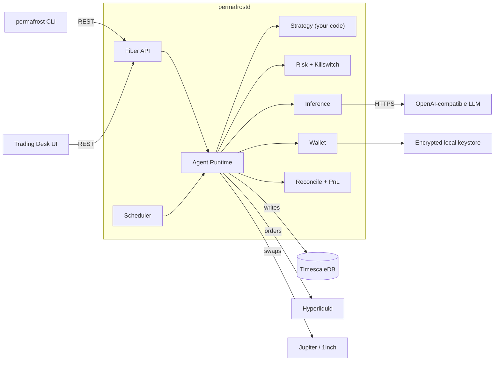

<div align="center">


# Permafrost

**Your AI trading desk, locked in the ice.**

A Go framework for self-custodied algorithmic trading with optional LLM augmentation. Hummingbot-style strategies. Real killswitch. Hand-authored arctic-themed operator UI.

[](https://opensource.org/licenses/MIT)
[](https://go.dev/)
[](https://github.com/teslashibe/permafrost/releases)
[](https://teslashibe.github.io/permafrost/)
[](https://hyperliquid.xyz/)
[](https://solana.com/)

📚 **[Read the docs](https://teslashibe.github.io/permafrost/)** &middot; 🐧 **[Run the demo](https://teslashibe.github.io/permafrost/getting-started/make-demo)** &middot; 🐳 **[The Cast](https://teslashibe.github.io/permafrost/brand/cast)**

</div>

---

## What this is

Permafrost is a self-custodied, locally-runnable trading framework built around a stable Strategy SAPI. You write deterministic Go strategies, optionally augment them with an LLM, and the framework handles exchange adapters, swap routing, reconciliation, PnL accounting, risk gates, the killswitch, and decision provenance.

Strategies are first-class extensions, not patches. Each one lives as its own subdirectory under `strategies/`, calls `strategy.Register` in `init()`, and is enabled by adding one blank-import line to each binary's `strategies.go`. See the [strategy authors guide](https://teslashibe.github.io/permafrost/strategies/sapi).

The OSS build ships three reference strategies (`noop`, `dca_buy`, `market_maker_basic`). Real strategies -- basis trades, market makers, anything you can express as Go -- are yours to build, share, or [keep private](https://teslashibe.github.io/permafrost/strategies/private-strategies).

---

## The expedition

Permafrost uses a polar-camp metaphor for every moving part of the framework. Every character is a hand-authored pixel-art SVG sprite that animates on the [Trading Desk UI](https://teslashibe.github.io/permafrost/operations/trading-desk-ui).

<table>
<tr>
<td align="center" width="11%"><br/><b>Pole</b><br/><sub>Camp Director</sub></td>
<td align="center" width="11%"><br/><b>Penguin</b><br/><sub>Strategy agent</sub></td>
<td align="center" width="11%"><br/><b>Narwhal</b><br/><sub>LLM consult</sub></td>
<td align="center" width="11%"><br/><b>Aurora</b><br/><sub>Risk monitor</sub></td>
<td align="center" width="11%"><br/><b>Skipper</b><br/><sub>Reconciler</sub></td>
<td align="center" width="11%"><br/><b>Kelp</b><br/><sub>Swap router</sub></td>
<td align="center" width="11%"><br/><b>Frostbite</b><br/><sub>Killswitch</sub></td>
<td align="center" width="11%"><br/><b>Tusk</b><br/><sub>Private strategy</sub></td>
</tr>
</table>

---

## Quick start

> Requires Docker and Go 1.25+.

```bash
git clone https://github.com/teslashibe/permafrost.git
cd permafrost
make demo
```

That's it. `make demo` builds the binaries, brings up Postgres + `permafrostd` in Docker, runs the [`init` wizard](https://teslashibe.github.io/permafrost/getting-started/init-and-doctor), recruits a paper-mode `noop` agent named **Pip**, and tails decisions in your terminal. Tear down with `make demo-clean`.

For the manual walk-through (one command at a time), see [local install](https://teslashibe.github.io/permafrost/getting-started/local-install).

### Trading Desk UI

```bash
cd apps/desk
npm install
npm run dev          # http://127.0.0.1:5173
```

The arctic-themed operator dashboard. Drag the HUDs, drag the characters, watch decisions land in real time. Falls back to demo data when the daemon isn't running. See [Trading Desk UI docs](https://teslashibe.github.io/permafrost/operations/trading-desk-ui).

---

## What you get out of the box

| Area | Capabilities |
|---|---|
| **Framework** | Generic Strategy SAPI · Hummingbot-style `strategies/` tree · `pkg/strategy`, `pkg/types`, `pkg/inference` |
| **Perp venues** | Hyperliquid (EIP-712 action signing, OpenOrders, idempotent place/cancel) |
| **Spot venues** | Solana via Jupiter (Jito bundles) · EVM via 1inch v6 (Ethereum, Base, Avalanche, BSC) |
| **Custody** | Self-custodied keystore; private key bytes never leave `internal/wallet` |
| **Risk** | Pre-trade limits, circuit breakers (drawdown, daily loss, funding flip) |
| **Killswitch** | Real: cancels open orders, flattens shorts, opt-in spot liquidation to USDC via SwapVenue |
| **AI** | OpenAI-compatible LLM-veto (OpenAI, OpenRouter, Groq, vLLM, Ollama) · decision provenance to the prompt |
| **Strategies** | `noop`, `dca_buy`, `market_maker_basic` · `permafrost strategy-new` scaffolds your own |
| **Tooling** | `permafrost init`, `doctor`, `agent`, `vault`, `wallet`, `serve`, `backtest` |
| **Distribution** | Multi-arch Docker on GHCR (amd64 + arm64) · `cli` compose service · `make demo` one-shot |
| **UI** | React + Vite arctic-themed Trading Desk with hand-authored pixel-art sprites |

---

## Architecture



Full architecture page: [docs/introduction/architecture](https://teslashibe.github.io/permafrost/introduction/architecture).

---

## Going live

Paper mode is the default -- real market data, no real orders. To trade real money:

```bash
# Import your spot signer (Solana keypair, Phantom-style JSON / base58 / hex)
permafrost wallet import --chain solana --from ~/.config/solana/id.json

# Import your Hyperliquid perp signer (hex private key in a file)
echo "0xYOUR_PRIVATE_KEY" > /tmp/hl-key
permafrost wallet import --chain hyperliquid --from /tmp/hl-key
shred -u /tmp/hl-key

permafrost vault init
permafrost agent set-mode <id> live
permafrost agent run     <id> --confirm-live   # explicit foreground gate
```

**EVM RPCs:** pick fresh ones from [chainlist.org](https://chainlist.org/) and drop them into `config.yaml`. Public defaults rate-limit aggressively in production.

> ⚠ **Live-mode gating note:** `--confirm-live` is currently only enforced by `agent run`. The daemon supervisor doesn't re-prompt. Tracked by [#38](https://github.com/teslashibe/permafrost/issues/38).

---

## Safety

A leveraged AI agent will absolutely try to nuke a vault if you let it. Permafrost ships with non-negotiable guardrails:

- **Spot-first execution** -- DEX swap must confirm before the perp short is sent
- **Idempotent intents** -- every order and swap carries a deterministic client ID
- **Decision provenance** -- every order links back to the exact prompt + model response
- **Paper mode by default** -- real orders require explicit `--confirm-live`
- **Per-agent circuit breakers** -- drawdown, daily loss, funding flip
- **Real killswitch** -- cancels open orders, flattens shorts via reduce-only market orders, opt-in spot liquidation to USDC via the configured `SwapVenue`. Documented at [killswitch tuning](https://teslashibe.github.io/permafrost/operations/killswitch-tuning).
- **Mainnet gating** -- Hyperliquid live mode behind explicit per-agent flags

When something does go wrong, **Frostbite the Whale** surfaces -- that's the killswitch character on the dashboard.

---

## CLI

```
permafrost init                      # interactive setup wizard
permafrost doctor                    # preflight check (Go / Docker / DB / RPCs / strategies)
permafrost strategy-new <name>       # scaffold a new strategy

permafrost wallet     show | generate | import | path
permafrost vault      init | deposit | withdraw | lockup | status | record-nav | nav
permafrost agent      create | list | status | decisions | set-mode | set-network | start | stop | tick | run
permafrost strategy   list | backtest <name>
permafrost inference  test | list
permafrost swap       quote
permafrost risk       show
permafrost pnl        summary | positions | history
permafrost reconcile
permafrost db         migrate
permafrost serve
permafrost version
```

Full reference: [`/reference/cli`](https://teslashibe.github.io/permafrost/reference/cli).

---

## Tech stack

| Layer | Choice |
|---|---|
| Language | Go 1.25+ |
| HTTP API | [Fiber](https://gofiber.io/) |
| Database | [TimescaleDB](https://www.timescale.com/) |
| Migrations | [`goose`](https://github.com/pressly/goose) |
| Query layer | [`sqlc`](https://sqlc.dev/) over [`pgx`](https://github.com/jackc/pgx) |
| CLI | [`cobra`](https://github.com/spf13/cobra) |
| Config | [`viper`](https://github.com/spf13/viper) |
| Logging | [`log/slog`](https://pkg.go.dev/log/slog) |
| Perp | [Hyperliquid](https://hyperliquid.xyz/) |
| Spot | [Jupiter](https://jup.ag/) (Solana) · [1inch v6](https://1inch.io/) (EVM) |
| MEV | [Jito](https://www.jito.wtf/) bundles |
| Inference | OpenAI-compatible (OpenAI, OpenRouter, Groq, vLLM, Ollama, …) |
| UI | React 18 + Vite 5, no framework, hand-authored SVG sprites |
| Deploy | Docker + docker-compose · Multi-arch GHCR image |

---

## Roadmap

v0.1.0 (this release) closes the [Trading Desk epic](https://github.com/teslashibe/permafrost/issues/30):

| | Milestone | Status |
|---|---|---|
| M0 | Skeleton (config, logging, compose, migrations) | ✅ |
| M1 | Core interfaces (`Strategy`, `Venue`, `SwapVenue`, `Provider`, `Signer`, `Risk`) | ✅ |
| M2 | Hyperliquid adapter | ✅ |
| M3 | OpenAI-compatible inference | ✅ |
| M4 | Wallet & keystore | ✅ |
| M5 | Solana SwapVenue (Jupiter + Jito) | ✅ |
| M6 | Asset registry | ✅ |
| M7 | Vault & accounting | ✅ |
| M8 | Agent runtime | ✅ |
| M9 | Risk + circuit breakers + real killswitch | ✅ |
| M10 | Backtest harness | ✅ |
| M11 | EVM SwapVenue (1inch v6, multi-chain) | ✅ |
| M12 | Operator tooling (`init`, `doctor`, `make demo`, `strategy-new`) | ✅ |
| M13 | Multi-arch Docker image (GHCR) | ✅ |
| M14 | Reference strategies (`dca_buy`, `market_maker_basic`) | ✅ |
| M15 | Trading Desk UI + sprite cast | ✅ |
| M16 | Brand narrative + cast docs | ✅ |

Up next: hosted vault accounting on-chain, additional venues, more reference strategies.

---

## Contributing

Contributions welcome. Read the [strategy authors guide](https://teslashibe.github.io/permafrost/strategies/sapi) (for new strategies) and [architecture](https://teslashibe.github.io/permafrost/introduction/architecture) before opening a PR.

---

## License

[MIT](LICENSE)

<div align="center">
<sub>The expedition is on the ice. 🐻🐧🦄🦉🐕🦣🐳🪙</sub>
</div>
