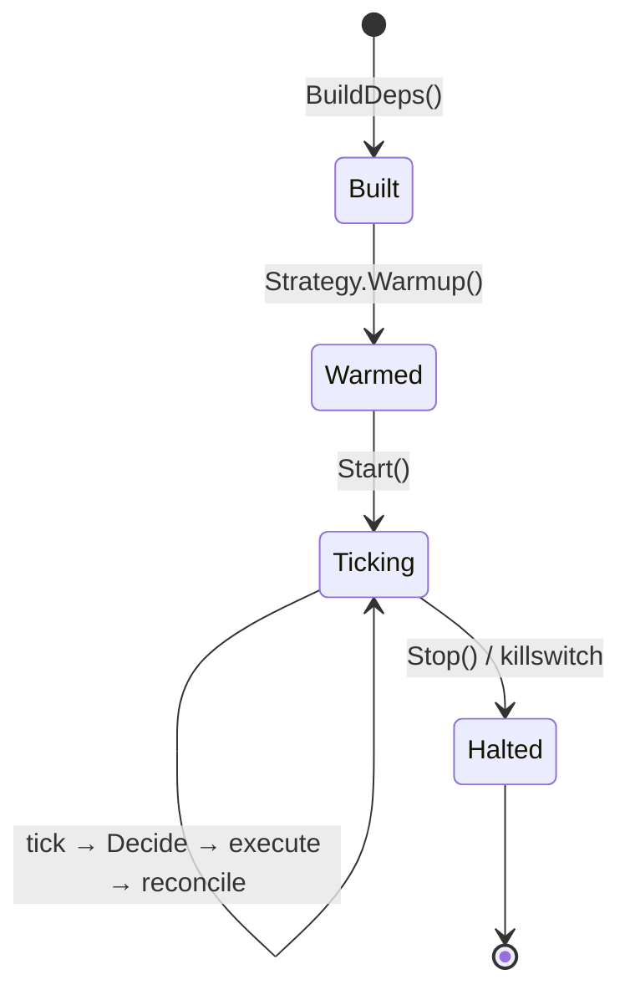

# Agent runtime

The `agent.Runtime` is the engine that turns a `Strategy` into a real, capital-deploying process.

## Lifecycle

1. **Build.** `agent.BuildDeps(a, …)` constructs venues, signers, the swap router, the risk engine, the strategy, and the inference provider for one agent. Same code path is used by both the foreground `agent run` CLI and the background supervisor inside `serve`, so behaviour stays identical.
2. **Warmup.** `Runtime.Start` calls `Strategy.Warmup(ctx, in)` once. The strategy receives `WarmupInput` carrying the agent's universe, config, and the framework `Services` (logger, inference). Warmup failures abort `Start` so the operator notices at agent-launch time.
3. **Tick loop.** A `time.Ticker` fires every `agent.tick_secs`. Each tick assembles `DecisionInput`, calls `Strategy.Decide`, executes the returned `Decision` (swaps before orders), runs reconciliation, and persists everything.
4. **Stop.** `Runtime.Stop` graceful-cancels the loop. The persisted agent status is unchanged; to permanently halt, set status to `halted` via the CLI.

## Per-tick execution order

For a `Decision{Swaps: [s], Orders: [o], Cancels: [c]}`:

1. **Cancels** are sent to the perp venue first.
2. **Swaps** execute and are awaited until confirmation. If a swap fails, the matching `Order` (same `BasisKey`) is dropped — no half-filled basis.
3. **Orders** are sent only after every swap with a matching `BasisKey` confirms.
4. The decision (with its prompt + LLM response if any) is persisted along with resulting tx hashes / venue order IDs.
5. Reconciliation reads venue + on-chain state and updates `BasisPosition` rows.
6. PnL is recomputed.

This order is the **spot-first invariant** that makes delta-neutral strategies safe. Strategies do not have to enforce it themselves — the runtime guarantees it.

## Concurrency

One supervisor goroutine per running agent. Strategy `Decide` calls within an agent are strictly sequential — each tick waits for the previous to complete (or hit the tick deadline). Across agents, ticks happen in parallel; the runtime is goroutine-safe.

## Where it lives

- `internal/agent/runtime.go` — the `Runtime` itself.
- `internal/agent/builder.go` — `BuildDeps`, `BuildStrategy`, `BuildHyperliquidVenue`.
- `internal/agent/supervisor.go` — keeps a `Runtime` per running agent on daemon boot.
- `internal/agent/killswitch.go` — the global stop everything switch.

## Next steps

- [Risk and the killswitch](/concepts/risk-and-killswitch)
- [Reconcile and PnL](/concepts/reconcile-and-pnl)
