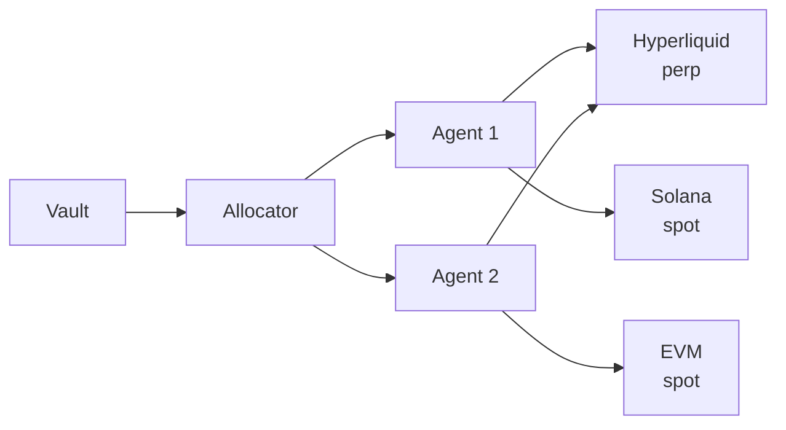
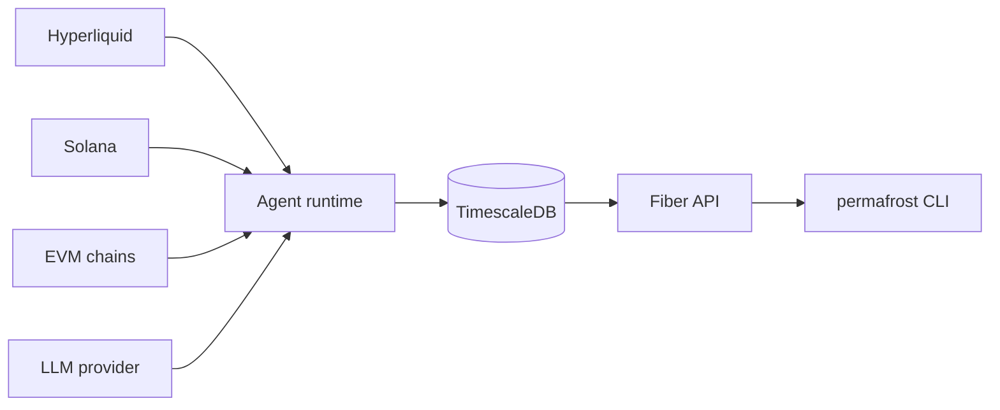

# Primitives

Five concepts the entire framework revolves around.

## Vault

The "permafrost." Holds locked capital and realized gains. Tracks deposits, lockups, NAV, high-water mark. v1 keeps accounting off-chain (Postgres rows); v2 will move it on-chain.

## Wallet

A self-custodied keypair on a chain. v1 ships with one Solana keypair plus one Hyperliquid signer per operator. The wallet's address is the spot custody endpoint -- the long leg of every basis trade lives here.

## Strategy

Pure logic. Given market state, positions, and signals, produces target actions (`OrderIntent`s and `SwapIntent`s). Stateless across process restarts; all persistent state lives in the framework's store and gets rehydrated into `DecisionInput`. See [the SAPI](/strategies/sapi).

## Agent

A runtime that wraps a `Strategy` with: an inference provider, one or more venues, risk limits, a tick schedule, and a decision log. Agents are the unit of deployment. One database row per agent; one supervisor goroutine per running agent.

## Position

A logical trade. For a delta-neutral basis strategy, a position is a *pair* (long spot leg + short perp leg) with combined PnL. The `BasisPosition` type tracks both legs and their state (`opening`, `open`, `closing`, `closed`).

## Capital flow

## Telemetry flow

## Next steps

- [Agent runtime](/concepts/agent-runtime)
- [Risk and the killswitch](/concepts/risk-and-killswitch)
