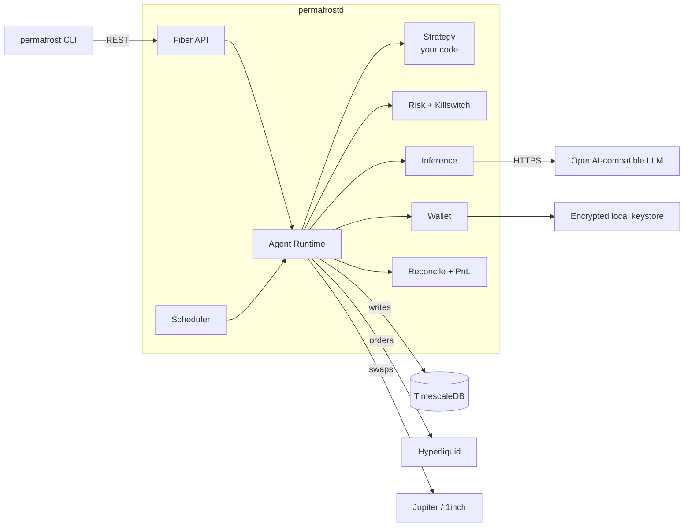

# Architecture

Permafrost is a single Go binary (`permafrostd`) plus a CLI (`permafrost`) plus Postgres (TimescaleDB). One operator, one daemon, many agents.



## Layout

```
permafrost/
├── cmd/
│   ├── permafrost/             CLI entrypoint (cobra)
│   └── permafrostd/            daemon entrypoint
│       ├── main.go
│       ├── strategies.go       committed: blank-imports community strategies
│       └── strategies_local.go gitignored: blank-imports private strategies
├── pkg/                        stable public SAPI (used by strategy authors)
│   ├── strategy/               Strategy, Decision, Services, registry
│   ├── types/                  trading-domain types
│   └── inference/              Provider interface + OpenAI-compatible client
├── strategies/                 canonical home for strategy packages
│   ├── noop/                   reference implementation
│   └── private/                gitignored
│       └── <your_strategy>/
└── internal/                   framework internals (not part of the SAPI)
    ├── agent/                  runtime, supervisor, builder, killswitch
    ├── exchange/hyperliquid/   perp venue
    ├── swap/jupiter/           Solana spot
    ├── swap/oneinch/           EVM spot
    ├── chain/{evm,solana}/     RPC clients + tx tracking
    ├── wallet/                 keystore + signers (only place that touches key bytes)
    ├── assets/                 hand-curated asset registry
    ├── risk/                   pre-trade + portfolio risk
    ├── reconcile/              position reconciliation
    ├── pnl/                    PnL accounting
    ├── store/                  Timescale repo (sqlc + pgx)
    ├── api/                    Fiber handlers
    └── cli/                    cobra command tree
```

## Data flow per tick

1. The scheduler fires a tick for an agent at its configured interval.
2. The runtime builds `DecisionInput` from current market data, exchange positions, wallet balances, and reconciled basis positions.
3. The runtime calls `Strategy.Decide(ctx, in)`.
4. The returned `Decision` carries `Swaps`, `Orders`, and `Cancels`.
5. **Swaps execute first.** The runtime waits for confirmation before any matching `OrderIntent` is sent. This preserves the spot-first invariant for delta-neutral strategies.
6. Orders are placed on the perp venue.
7. Pre- and post-trade risk checks run; the killswitch can abort.
8. The decision (including the LLM prompt + response if any) is persisted to TimescaleDB along with the resulting on-chain tx hashes / venue order IDs.
9. Reconciliation reads venue + chain state and updates basis positions; PnL is recomputed.

## Layering rules

- Strategies depend on `pkg/strategy` and `pkg/types`. They MAY import `internal/*` packages directly (single-module repo) but doing so couples them to internals that may change without notice.
- `internal/agent.BuildStrategy` is a pure registry lookup — no per-strategy special-casing. Strategies own their own typed config parsing inside their `Constructor` and pull framework services from `WarmupInput.Services`.
- `internal/store` is the only package that imports `pgx`.
- `internal/wallet` is the only package that touches private key bytes.

## Next steps

- [Concepts: primitives](/concepts/primitives)
- [Local install](/getting-started/local-install)
